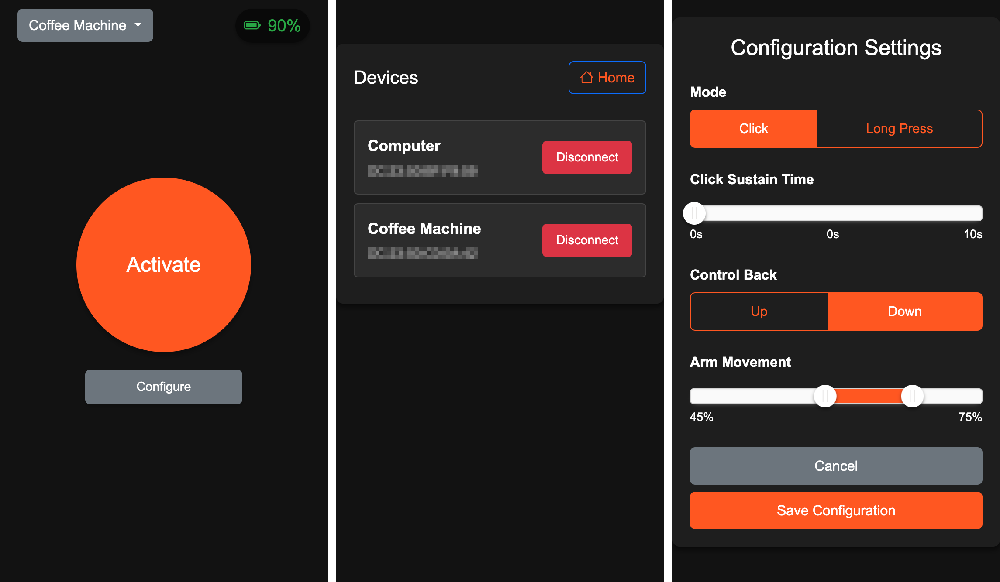

# Fingerbot Web

## Description
Fingerbot-Web is a web interface designed to control and manage CUBETOUCH II button pusher Tuya devices via BLE (locally)

## Tuya BLE
The Tuya BLE communication is implemented inside the `/internal/tuyable` package. It should be possible to use it for any Tuya BLE protocol version 3 device although I haven't tested it with any devices besides the CUBETOUCH II fingerbot.

## Screenshots

## License
This project is licensed under the MIT License. See the [LICENSE](LICENSE) file for more details.
